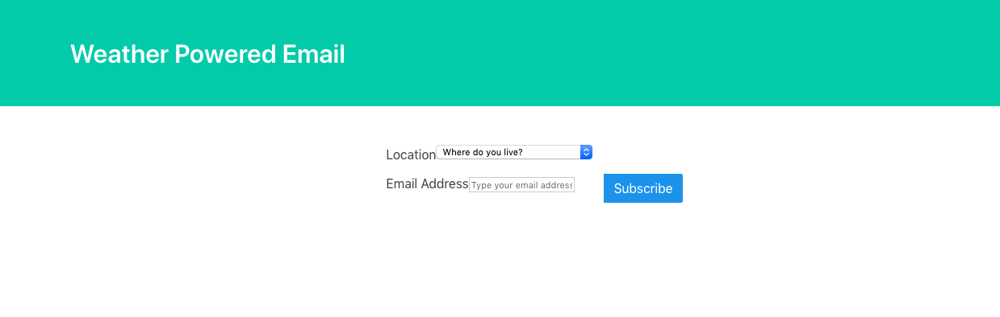
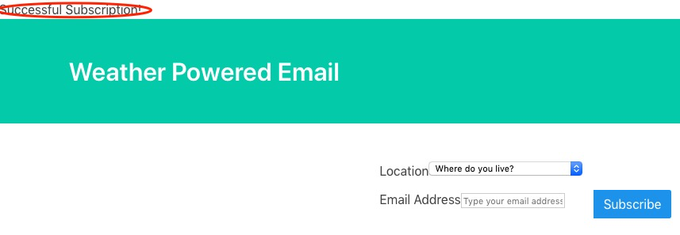
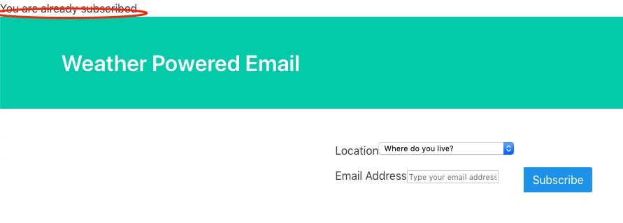
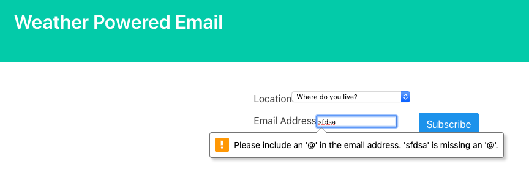

# Klaviyo
 Klaviyo challenge https://www.klaviyo.com/weather-app

## KlaviyoApp:  Weather Powered Email

## Weather App:
The weather App contains a home page and a newsletter template.

## Functions:
1. Users can enter their email address and locations from a list of the top 100 cities to sign up.
* Invalid email address and duplicated email address are not allowed to sign up.

2. For each subscriber, they will get personalized email based on recipient's location and forecasted weather.

3. Command line can be used to send emails for subscribers.
   ```
   $ python manage.py sendEmails
   
   ```
## Results:

#### home page:



#### success confirmation:



#### fail page:



#### invalid check:



## Future works
1. Use Google place API instead of manually add cities to do the auto completion.

2. Use Mailchimp and Mandrill to create campaign and to send campaign automatically.

3. Add login and logout feature.

4. Make the pages more pleasant.
